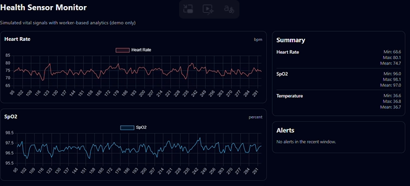

# Health Sensor Monitor

Health Sensor Monitor is a **technical demo** built with Angular 21 that simulates vital-like sensor signals (heart rate, SpO2, temperature), processes them in a **Web Worker**, and visualizes them with **Chart.js**.

It is **not** a medical tool and does **not** provide real-world medical advice. It is purely for learning and portfolio purposes.

---

## Live Demo

GitHub Pages:

https://vinaygs911.github.io/health-sensor-monitor/

---

## Features

- Simulated sensor data:
  - Heart rate (bpm)
  - SpO2 (percent)
  - Temperature (deg C)
- Continuous data generation:
  - New readings added every second
  - Rolling buffer of recent points (e.g., last 200 per sensor)
- Web Worker analytics:
  - Per-sensor min, max, mean, std dev over the recent window
  - Simple threshold-based “alert” flags (e.g., heart rate above range)
  - Worker execution time (ms) for each batch
- Visualization:
  - Separate line chart per sensor
  - Summary card with stats
  - Alerts panel listing any sensors outside nominal ranges

Again: this is a **simulation** for architectural demonstration only.

---

## Tech Stack

- **Angular 21.1**
  - Standalone components
  - Signals for local state
  - `provideRouter`, `provideHttpClient`
- **Web Workers**
  - Off-main-thread analytics: statistics and alerts
- **Chart.js 4.4.4** + **ng2-charts 5.0.4**
  - Via a small `ChartsModule` wrapper
- **TypeScript 5.9**
- **GitHub Actions** + **GitHub Pages** for CI/CD and hosting

---

